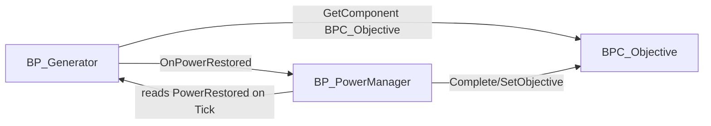

# Blueprint Dependency Map

Status: Active  
Version: 1.0  
Mission: PE-014  

---

# Purpose

Tree of major Blueprint relationships as implemented (MCP asset dependencies + graph inspection). Uses post–DOC-002 / ASSET-001 `BPC_*` names.

---

# Core Player Tree

```text
BP_GameMode
├── Default Pawn → BP_PlayerCharacter
│   ├── BPC_Interaction  → BPI_Interactable
│   ├── BPC_Inventory    → ST_InventoryItem
│   ├── BPC_Objective    → WBP_Objective
│   ├── BPC_Flashlight
│   └── Enhanced Input Actions (IA_Move/Look/Jump/Sprint/Interact/Flashlight)
├── Player Controller → BP_PlayerController
│   └── IMC_Player
└── HUD → BP_HUD

BP_GameInstance (stub)
BP_SaveGame (stub)
```

---

# Interaction Family

```text
BPI_Interactable
└── BP_InteractableBase
    ├── BP_Door
    ├── BP_LockedDoor          → BPC_Inventory (RequiredItemID)
    ├── BP_NotePickup          → WBP_NoteReader, BPC_Objective
    ├── BP_FlashlightPickup    → BPC_Flashlight, BPC_Objective
    ├── BP_FuelCan             → BPC_Inventory
    ├── BP_KeyItemPickup       → BPC_Inventory, BPC_Objective
    └── BP_Generator           → BPC_Inventory, BPC_Objective, OnPowerRestored
```

`BPC_Interaction` depends on `BPI_Interactable` and calls Interact/CanInteract on traced HitActor (runtime path targets interactable base/interface implementers).

---

# Power Family

```text
BP_Generator
├── implements BPI_Interactable (via InteractableBase)
├── reads/writes BPC_Inventory / BPC_Objective on Interactor
└── Event Dispatcher OnPowerRestored
    └── BP_PowerManager (binds BeginPlay; also Tick-polls PowerRestored)
        ├── GetAllActorsOfClass → BP_EmergencyLight
        ├── GetAllActorsOfClass → BP_PoweredDoor
        ├── GetAllActorsOfClass → BP_PowerAmbientFeedback
        ├── GetAllActorsOfClass → BP_VentilationUnit
        ├── GetAllActorsOfClass → BP_PASpeaker
        ├── GetAllActorsOfClass → BP_DistantActivityHint
        └── BPC_Objective (player) Complete + SetObjective

BPI_PowerReceiver
└── OnPowerRestored (intended contract for receivers)
    └── Note: PowerManager currently hard-references concrete classes
```

---

# UI Dependencies

```text
BPC_Objective → WBP_Objective (Setup)
BP_NotePickup → WBP_NoteReader (SetupNote)
BP_HUD → (GameMode HUD class; widgets created by components/actors)
```

---

# Input Assets

```text
IMC_Player
├── IA_Move, IA_Look, IA_Jump, IA_Sprint, IA_Interact, IA_Flashlight  (mapped)
└── IA_Crouch, IA_Inventory, IA_Journal, IA_Pause                    (assets only)
```

---

# Data

```text
ST_InventoryItem ← BPC_Inventory / FuelCan / KeyItemPickup / FusePickup
E_GeneratorState ← BP_Generator.GeneratorState
E_PuzzleState ← BP_PuzzleBase.CurrentState (byte-aligned lifecycle)
```

---

# Puzzle (PE-015)

```text
BPI_Puzzle
BP_PuzzleBase
├── dispatchers OnPuzzle*
├── NotifyObjectives → BPC_Objective
└── TriggerWorldResponse → BPI_PowerReceiver + BP_PowerManager.NotifyPuzzlePowerResponse
    ├── BP_FusePuzzle → BPC_Inventory (Fuse)
    ├── BP_FusePickup → BPC_Inventory / BPC_Objective
    ├── BP_PuzzleResetButton → ResetPuzzle + spawn FusePickup
    └── BP_PuzzleManager (optional hub)
```

---

# Maps → Systems

```text
LV_TestingGround
├── places Generator, FuelCan, PowerManager, receivers, doors, pickups, notes
├── PE-015 Puzzle Station (FusePickup, FusePuzzle, Reset, tagged EmergencyLight)
├── PlayerStart_DeveloperSpawn
└── BP_DevSandboxValidator
```

---

# Soft vs Hard Coupling

| From | To | Coupling |
|------|----|----------|
| BPC_Interaction | BPI_Interactable | **Preferred** (interface check) |
| Generator / pickups / puzzles | BPC_Inventory / BPC_Objective | **Hard** `GetComponentByClass` |
| PowerManager | Receiver BP classes | **Hard** `GetAllActorsOfClass` |
| PowerManager | BPI_PowerReceiver | Interface exists; **not** used for discovery |
| PuzzleBase | BPI_PowerReceiver | **Preferred** interface message on configured targets |
| PuzzleBase | PowerManager | Soft `GetAllActorsOfClass` + `NotifyPuzzlePowerResponse` |
| Character | Components | **Composition** (correct) |
| Controller | Character EI | Indirect via IMC |

---

# Circular Dependencies / Concerns



### Concerns (not hard compile cycles)

1. **Generator ↔ PowerManager redundancy**  
   Dispatcher bind **and** Tick poll of `PowerRestored`. Safe once-only via `HasHandledPower`, but dual paths increase complexity.

2. **Dual objective writers**  
   Generator `FinishGeneratorStart` calls `CompleteObjective`; PowerManager also completes and sets a new objective. Order depends on dispatcher vs Tick. Works in practice; fragile if either path changes.

3. **PowerManager → concrete receivers**  
   Adding a new `BPI_PowerReceiver` requires editing PowerManager (not plug-and-play). Circular risk is low; **scalability concern** is high.

4. **Interactables → Objective/Inventory**  
   Many actors hard-depend on player component classes. Acceptable for M1; prefer interfaces/subsystem later to avoid Character layout assumptions.

5. **No Character ↔ Component cycles**  
   Components do not depend back on Character Blueprint asset paths beyond `GetOwner` — healthy.

6. **Empty `/Game/ProjectEcho/Blueprints/` tree**  
   Legacy folder after ASSET-001 move; unused vs `Gameplay/` (safe cleanup candidate).

---

# Recommended Future Shape (Not Implemented)

```text
BP_PlayerCharacter
  └── components only

World actors
  └── BPI_Interactable / BPI_PowerReceiver only

BP_PowerManager
  └── GetAllActorsWithInterface(BPI_PowerReceiver)

Save / Puzzle / AI
  └── subscribe to existing dispatchers; do not parent under Generator
```

---

# Related

- `EventFlow.md` — runtime chains  
- `TechnicalDebt.md` — duplicate vars/events  
- `GameplaySystems.md` — APIs  
