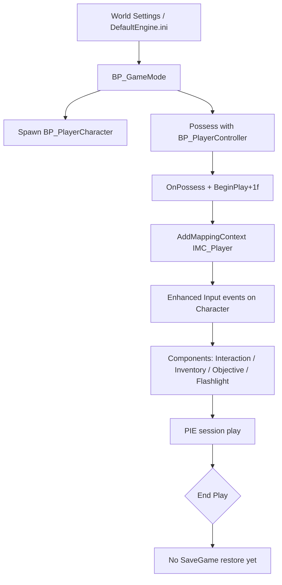
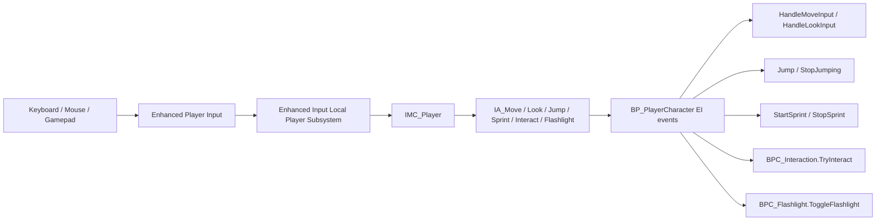
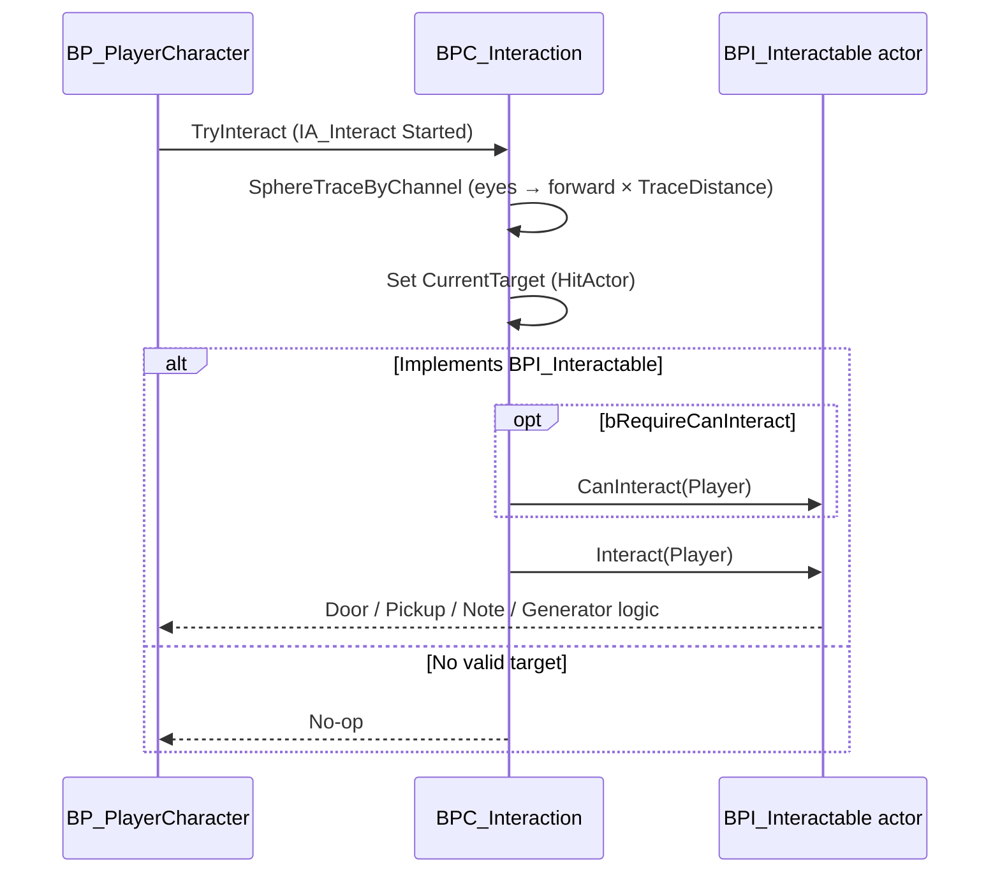
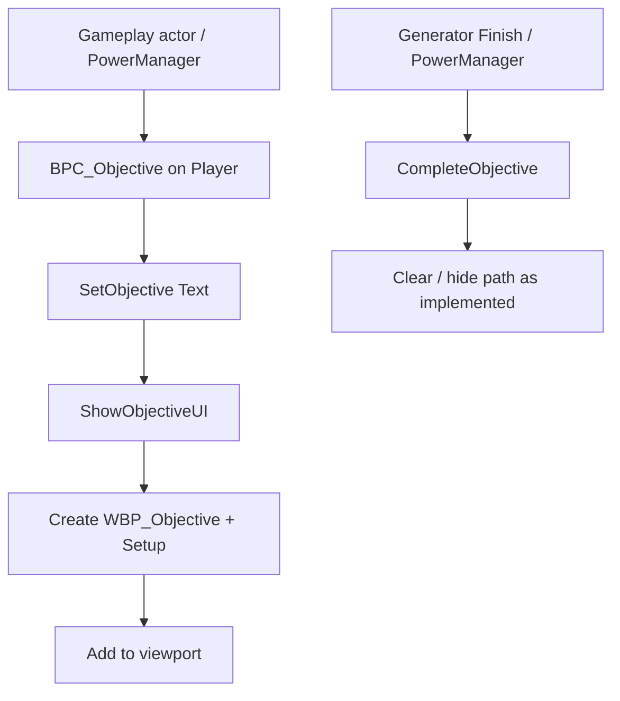
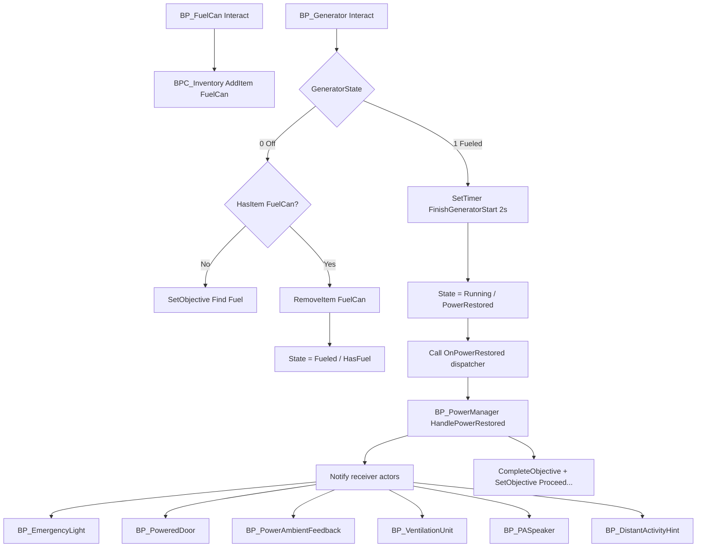

# Gameplay Flow

Status: Active  
Version: 1.0  
Mission: PE-014  

---

# Purpose

This document describes the **implemented** end-to-end gameplay flow for Project Echo as of PE-014.

It is an architecture consolidation pass: no new gameplay features. Validation sandbox: `LV_TestingGround`.

---

# Complete Gameplay Loop (Implemented)

```text
Spawn (BP_GameMode → BP_PlayerCharacter + BP_PlayerController)
  → Enhanced Input (IMC_Player)
  → Move / Look / Jump / Sprint
  → Interact (BPC_Interaction → BPI_Interactable)
  → Collect (BPC_Inventory / BPC_Flashlight / Notes)
  → Generator (fuel → start → OnPowerRestored)
  → PowerManager world response (BPI_PowerReceiver actors)
  → Objectives update (BPC_Objective → WBP_Objective)
  → Proceed (powered door / further exploration)
```

Design vision (Explore→Discover→Understand→Solve→Restore Progress→Reveal Story→Survive) is canonical in `Documents/01_Game_Design/GameplayDesignBible.md` (PE-016). Primer: `GameplayLoop.md`. This file tracks **code reality**.

---

# Player Lifecycle



**Owners**

| Role | Blueprint |
|------|-----------|
| GameMode | `/Game/ProjectEcho/Gameplay/Systems/BP_GameMode` |
| Character | `/Game/ProjectEcho/Gameplay/Characters/BP_PlayerCharacter` |
| Controller | `/Game/ProjectEcho/Gameplay/Characters/BP_PlayerController` |
| HUD | `/Game/ProjectEcho/UI/BP_HUD` |
| GameInstance | `/Game/ProjectEcho/Gameplay/Systems/BP_GameInstance` (EventGraph empty) |

**Known issue (PE-013C / BUG-008):** IMC registration was broken when GetEIS used an unbound PlayerController pin. Uncommitted dirty fixes on Character/Controller may still be present on disk — gameplay WASD confirmation remains `PENDING_USER` until validated in focused PIE.

---

# Input Flow



**Mapped actions (IMC_Player):** `IA_Move`, `IA_Look`, `IA_Jump`, `IA_Sprint`, `IA_Interact`, `IA_Flashlight`

**Present but unmapped (future):** `IA_Crouch`, `IA_Inventory`, `IA_Journal`, `IA_Pause`

---

# Interaction Flow



**Trace:** Visibility channel (`TraceTypeQuery1`), radius `TraceRadius`, distance `TraceDistance`.

**Base class:** Most world interactables parent `BP_InteractableBase` (`CanInteract`, `GetInteractionText` defaults). Runtime Interact overrides live on child EventGraphs (`EventInteract`).

---

# Objectives Flow



**Public API (inspected):** `SetObjective`, `CompleteObjective`, `ClearObjective`, `ShowObjectiveUI`, `HideObjectiveUI`, `GetCurrentObjective`

**Typical callers:** `BP_FlashlightPickup`, `BP_NotePickup`, `BP_KeyItemPickup`, `BP_Generator`, `BP_PowerManager`

---

# Generator → Power → World Response



**Interface:** `BPI_PowerReceiver` exposes `OnPowerRestored` (also a duplicate `OnPowerRestored_0` — see Technical Debt).

**Implementation note:** `BP_PowerManager` currently finds receivers via `GetAllActorsOfClass` per concrete type, not a single interface query. Tick also polls `BoundGenerator.PowerRestored` as a redundancy path.

---

# Notes Flow

```mermaid
sequenceDiagram
  participant Player
  participant Note as BP_NotePickup
  participant Obj as BPC_Objective
  participant UI as WBP_NoteReader
  Player->>Note: Interact
  Note->>UI: CreateWidget + SetupNote(Title, Body)
  Note->>UI: AddToViewport
  alt First collect
    Note->>Note: bCollected = true
    Note->>Obj: SetObjective Locate the Facility Key
  end
```

Notes are **read-in-place** (not inventory items). Journal system is not implemented.

---

# Planned Integration Points (Not Implemented)

## Save / Load

Stub asset: `/Game/ProjectEcho/Gameplay/Save/BP_SaveGame` (no variables yet).  
Plan: `Documents/02_Technical/SaveSystem.md`.

Suggested hook points when implemented:

| Data | Source |
|------|--------|
| Transform | `BP_PlayerCharacter` |
| Inventory | `BPC_Inventory.Items` |
| Flashlight | `BPC_Flashlight` (`bHasFlashlight`, `bIsOn`) |
| Objectives | `BPC_Objective.CurrentObjective` |
| Power | `BP_Generator.PowerRestored` / `BP_PowerManager.HasHandledPower` |
| Notes | per-instance `bCollected` |

Likely owner: `BP_GameInstance` (currently empty EventGraph).

## Puzzle Integration

Implemented (PE-015). See `PuzzleFramework.md`.

```text
BP_FusePickup Interact
  → BPC_Inventory.AddItem(Fuse)
  → BPC_Objective.SetObjective("Insert the fuse…")

BP_FusePuzzle Interact
  → HasItem("Fuse") → RemoveItem → MarkSolved
  → OnPuzzleSolved / NotifyObjectives / TriggerWorldResponse
  → BPI_PowerReceiver (+ PowerManager.NotifyPuzzlePowerResponse)

BP_PuzzleResetButton Interact
  → BP_PuzzleBase.ResetPuzzle + optional Fuse respawn
```

Lifecycle: Idle → Available → Activated → InProgress → Solved → World Response → Completed.

## AI / Horror

`BP_WitnessSilhouetteHint` (PE-017 / PE-018) — presence beat via `BPI_PowerReceiver`. On `LV_ARI_MaintenanceWing` after fuse puzzle World Response; on `LV_ARI_GeneratorAnnex` after generator `HasHandledPower` World Response. Tension / silhouette / print feedback only — not chase AI.

Future AI Arena reserved on sandbox. Movement helpers `OnMovementStateChanged` / `GenerateMovementNoise` exist on Character as expansion stubs for future AI hearing.

---

# Validation Sandbox

**Map:** `/Game/ProjectEcho/Maps/Development/LV_TestingGround`

Stations (labels): Movement, Interaction, Inventory, Generator, Power, Objectives, Notes, Puzzle (hub-adjacent Fuse station), Future AI, Developer Control.

**Technical validator:** `BP_DevSandboxValidator` — API/state checks when Slate key injection cannot drive Enhanced Input (BUG-007).

**Prototype regression maps:** `LV_Prototype_PE011`, `LV_Prototype_PE012`

**Production vertical slice (PE-017):** `/Game/ProjectEcho/Maps/Production/LV_ARI_MaintenanceWing` — see `Documents/05_Missions/PE-017-VerticalSlice01.md`.  
**Generator Annex (PE-018):** `/Game/ProjectEcho/Maps/Production/LV_ARI_GeneratorAnnex` — see `Documents/05_Missions/PE-018-GeneratorAnnex.md`.

---

# Related Documents

- `01_Game_Design/GameplayDesignBible.md` — **canonical** gameplay design (PE-016); required for PE-017+
- `05_Missions/PE-017-VerticalSlice01.md` — Maintenance Wing slice
- `05_Missions/PE-018-GeneratorAnnex.md` — Generator Annex
- `GameplaySystems.md` — per-system API status
- `PuzzleFramework.md` — PE-015 puzzle architecture
- `Architecture/BlueprintDependencyMap.md` — ownership tree
- `Architecture/EventFlow.md` — event chains
- `Architecture/TechnicalDebt.md` — debt review
- `BlueprintStandards.md` — authoring rules
- `04_Production/ProjectHealth.md` — health grades
