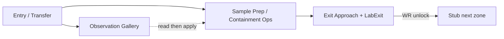

# PE-020 — Visual Design Package: Research Wing

**Status:** VDP complete — awaiting EP mental-play gate  
**Mission:** PE-020 Research Wing (Post-Coolant Laboratory)  
**Map:** `/Game/ProjectEcho/Maps/Production/LV_ARI_ResearchWing`  
**Branch:** `develop`  
**Date:** 2026-07-25  
**Design Plan:** [`PE-020-DesignPlan.md`](PE-020-DesignPlan.md)  
**Mission notes:** [`PE-020-ResearchWing.md`](PE-020-ResearchWing.md)  
**Authority:** Gameplay Design Bible (PE-016) §5.4 Research Equipment · Production Playbook §12c · Visual Design Package standard  

---

> ### Honesty — implementation already landed
>
> Unreal implementation already exists at `LV_ARI_ResearchWing` (commit `41c8e3c`).  
> This VDP documents the **playable fantasy** for EP mental-play review / retrofit quality — it is **not** a pre-implement gate waiver rewrite.  
> **Ready to Implement = N/A** (already implemented). Gate = documentation / experience quality.  
> Manual Gameplay PASS remains **PENDING_USER** (Enhanced Input).

---

## 1. Mission Overview

| Field | Content |
|-------|---------|
| **Fantasy** | After Coolant Bay equalizes plant circulation, the player enters a quieter clinical Research Wing where staff left a **containment / observation station** mid-calibration. Complete one Research Equipment ops problem — observe logged params → engage ST-TEMP / ST-SEAL → hold ST-LINK — so the lab exit unlocks. Something watches on the way out. |
| **Length** | ~15–20 minutes first play |
| **Rooms** | Entry / Transfer · Observation Gallery · Sample Prep / Containment Ops · Exit Approach + Lab Exit (Records Alcove cut) |
| **Systems reused** | Interaction, Notes, Objectives, `BP_PuzzleBase` family (CoolantLoop/Valve configured as Research stations; twin ContainmentCalibration assets prepared), Power receivers / PoweredDoor, Witness silhouette, Soft Open Coolant→Research, SliceReset |
| **Teaching beat** | **Research Equipment** (Bible §5.4) — distinct from fuse, generator fuel, coolant valves |
| **Horror beat** | Quiet clinical unease → focused calibration → relief on handshake → **Witness on exit approach** (silhouette; colder / quieter than Coolant) |
| **Cut list** | Records Alcove · inventory sample gate · Security · fuse · generator · second puzzle family · Witness during solve · combat/chase |
| **Pillars** | Exploration · Observation · Psychological Tension · Environmental Storytelling · Meaningful Progression |

**Experience Summary:** The wing should feel like ordinary interrupted science waking wrong — cleaner and more clinical than Engineering wetness, denser environmental clues than mechanics, one coherent ops problem, then presence on the exit path. No quest-marker prose; notes are symptoms only.

**Emotional Curve:**

```text
Quiet clinical entry
    → Curiosity / unease (Observation glass + residue)
        → Focus (read checklist → apply stations)
            → Relief (exit unlock / observation response)
                → Spike (Witness on exit approach)
                    → Release (LabExit stub / Soft Open end-of-slice)
```

---

## 2. Player Journey

```text
Beginning → Middle → Ending
```

### Beginning (Spawn → Explore → Observe)

Player Soft Opens from Coolant Bay Pressure Hatch / Soft Open Exit into **Entry / Transfer Corridor**. Flashlight available. Partial lab lighting and hum (post-power + post-coolant narrative baseline) — but containment / observation still mid-procedure. Lab exit is locked.

- Read **Note A** (symptoms: coolant stable / lab feed live / containment unfinished — no directions).
- Hub spine opens toward Observation Gallery and Sample Prep / Containment Ops.
- Tone shift: clinical-industrial vs Coolant wetness; unfinished silence under the hum.

### Middle (Observe → Understand → Operate)

- **Observation Gallery:** Look through glass / boards. **Note B** calibration checklist gives station IDs and target states (ST-TEMP / ST-SEAL engage; ST-LINK hold). Objective: calibrate the containment chamber. Light backtrack Observation → Containment is intentional.
- **Sample Prep / Containment Ops:** Env residue (sealed carriers, fogged glass, prep trays). **Note C** (handshake pending). **Note D** (do not open exit under incomplete containment).
- **Operate:** Engage ST-TEMP + ST-SEAL; set ST-LINK to HOLD. Incomplete set → readable fail (amber / print debt); exit stays locked. No timer. No randomized solution.

### Ending (World Response → Witness → Exit)

- All stations match → `MarkSolved` → **World Response:** LabExit unlock, observation lights / ambient / PA / vent response (independent of generator `HasHandledPower`).
- **Exit Approach:** Delayed Witness silhouette + cold light → withdraw. Not during calibration.
- Interact **LabExit** (stub Soft Open / end-of-slice toward future Security — not built).
- SliceReset supports replay without UE restart.

---

## 3. Top-down Blockout

**Compass:** +Y = North, +X = East (match PE-017 / PE-018 / PE-019).  
**Recipe:** PE-018 production map spine (Coolant-derived blockout retargeted to Research narrative).

### Floor plan (ASCII)

```text
                         N (+Y)
                         ▲
                         │
        ┌────────────────┴────────────────┐
        │     OBSERVATION GALLERY          │
        │  [glass / boards]  Note B ★      │
        │  Landmark: frosted observation   │
        │              window              │
        └────────────┬─────────────────────┘
                     │ hub corridor
   W ◄───────────────┼───────────────────────► E (+X)
        ┌────────────┴────────────┐
        │  ENTRY / TRANSFER       │
        │  ★ Spawn (Soft Open)    │
        │  Note A                 │
        │  Landmark: transfer      │
        │  hatch / corridor spine  │
        └────────────┬────────────┘
                     │
        ┌────────────┴────────────────────────┐
        │  SAMPLE PREP / CONTAINMENT OPS      │
        │  Note C · Note D                    │
        │  ◆ ST-TEMP  ◆ ST-SEAL  ◆ ST-LINK   │
        │  ◈ BP Containment / CoolantLoop     │
        │    Puzzle (Research config)         │
        │  Landmark: chamber + station triad  │
        └────────────┬────────────────────────┘
                     │
        ┌────────────┴────────────────────────┐
        │  EXIT APPROACH + LAB EXIT           │
        │  👁 Witness (post-solve only)       │
        │  Note E (optional unease)           │
        │  🚪 LabExit LOCKED until WR         │
        │  Landmark: powered lab exit door    │
        └─────────────────────────────────────┘
                         │
                         ▼ S
```

**Legend**

| Symbol | Meaning |
|--------|---------|
| ★ | Spawn / Soft Open arrival |
| ◆ | Calibration station interact (Research Equipment) |
| ◈ | Puzzle actor (`MarkSolved` owner) |
| 👁 | Witness presence (exit path; post-solve) |
| 🚪 | Objective lock / LabExit |
| Note A–E | Symptom note pickups |

### Room connections



| From | To | Notes |
|------|-----|-------|
| Entry | Observation Gallery | North spur — env story densify |
| Entry | Sample Prep / Containment Ops | Primary ops route |
| Observation | Containment | Light backtrack OK (read → apply) |
| Containment | Exit Approach | Locked until Research solve WR |
| Records Alcove | — | **Cut** (length pressure) |

### Landmark map

| Landmark | Room | Player read |
|----------|------|-------------|
| Transfer hatch / Soft Open arrival | Entry | Continuity from Coolant |
| Frosted observation window + boards | Observation Gallery | “Someone was mid-procedure” |
| Chamber + three labeled stations | Containment Ops | Ops problem readable at a glance |
| Powered LabExit | Exit Approach | Goal door; locked until WR |
| Witness silhouette niche | Exit Approach | Post-solve presence only |

### Dimension intent (blockout scale)

| Room | Intent scale | Feel |
|------|--------------|------|
| Entry / Transfer | Narrow corridor ~8–12 m | Quiet arrival spine |
| Observation Gallery | Mid room with glass wall | Look-through storytelling |
| Sample Prep / Containment Ops | Largest ops volume | Stations readable; chamber center |
| Exit Approach | Short corridor to door | Compression before Witness |

---

## 4. Storyboard

Ordered scenes for mental play: **enter → notice → discover → solve → world response → Witness → exit**.

### Mission timeline

```text
0:00  Soft Open / spawn Entry
0:01  Notice clinical hum vs unfinished silence; Note A
0:03  Explore hub → Observation glass / boards
0:05  Discover Note B checklist (targets)
0:07  Sample Prep residue; Notes C / D
0:09  Operate stations (TEMP+SEAL engage; LINK hold)
0:14  World Response — LabExit unlock + observation response
0:15  Witness on exit approach
0:17  LabExit interact → stub end-of-slice
```

### Scene breakdown

| # | Beat | Scene | Player does | Sees / feels | Symptoms cue |
|---|------|-------|-------------|--------------|--------------|
| 1 | **Enter** | Soft Open into Transfer Corridor | Arrive; flashlight | Partial lab light; cleaner than Coolant | Note A: feed live / containment unfinished |
| 2 | **Notice** | Hub spine + locked LabExit in distance or signage | Orient | Exit gated; unfinished silence under hum | Spill tape / mute PA tags |
| 3 | **Discover** | Observation Gallery | Look through glass; read Note B | Frost / residue; calibration IDs on boards | Checklist crumbs — not walkthrough |
| 4 | **Discover** | Sample Prep bay | Scan trays / carriers | Sealed sample carriers; fogged glass | Note C: handshake pending |
| 5 | **Understand** | Containment warning | Read Note D near chamber | Do-not-open-exit residue | Incomplete containment risk |
| 6 | **Solve** | Station triad | Set ST-TEMP / ST-SEAL / ST-LINK to targets | Amber fail if incomplete | Note B IDs |
| 7 | **World Response** | Chamber settles | Watch unlock | Lights / ambient / PA / LabExit power | World acknowledges Research restore |
| 8 | **Witness** | Exit Approach | Approach exit | Delayed silhouette + cold light → withdraw | Note E optional unease |
| 9 | **Exit** | LabExit | Interact door | Stub next zone (Security deferred) | Meaningful progression |

**Horror rule:** Witness never replaces solvable station logic; presence only after `MarkSolved`.

---

## 5. Hero Concept Prompts

Prompts only (no generated images required for this VDP). Grounded industrial horror — clinical Asterion Research, not sci-fi chrome arcade.

### Color palette

| Role | Direction |
|------|-----------|
| Base | Cool concrete grey / sterile off-white panels |
| Accent | Muted teal instrument bezels; amber caution tape |
| Hazard / incomplete | Soft amber station lamps; cold cyan-white emergency accents |
| Witness | Desaturated cold blue-white; reduced fill |

### Material palette

Brushed steel instrument housings · frosted laminated observation glass · scuffed epoxy floor · yellowed plastic sample trays · rubber glove residue · cable raceways · printed checklist boards · sealed acrylic sample cradles.

### Mood board (prompt sets)

**1 — Entry / Transfer Corridor**  
`Asterion Research Institute transfer corridor, soft open from mechanical plant into clinical lab wing, partial fluorescent hum, scuffed epoxy floor, muted teal wall panels, abandoned clipboard on rail, cold concrete, psychological survival horror atmosphere, grounded industrial, no sci-fi chrome, UE5 cinematic still, desaturated`

**2 — Observation Gallery (hero)**  
`Laboratory observation gallery with frosted glass looking into containment chamber, incomplete calibration boards with station IDs, abandoned stool, residue on glass, clinical-industrial Asterion Research, quiet unfinished science, environmental storytelling, horror unease without gore, dim indoor lighting`

**3 — Sample Prep Bay**  
`Sample preparation bay Asterion Research, sealed sample carriers on trays, fogged glass, spill tape, abandoned gloves, handshake pending feel, clinical clutter readable, grounded facility realism, psychological horror mood`

**4 — Containment Chamber / Lab Ops (puzzle landmark)**  
`Containment chamber lab ops room, three labeled calibration stations ST-TEMP ST-SEAL ST-LINK around chamber console, amber incomplete lamps, observation link panel, industrial research equipment not arcade UI, Asterion Research Institute, readable gameplay landmark, dim clinical lighting`

**5 — Exit Approach + Witness**  
`Lab exit approach corridor after systems return, powered door silhouette, delayed distant humanoid silhouette in cold blue-white light then withdraw, quieter colder than mechanical plant, psychological presence horror, no chase, Asterion Research Wing`

**6 — Atmosphere pass**  
`Asterion Research Wing waking wrong, plant feed restored but labs unfinished, systems return and something watches, isolated scientific grounded tone, environmental storytelling denser than mechanics`

---

## 6. Lighting Concepts

```text
Before Power → After Power → Puzzle Solved → Witness
```

**Narrative baseline:** Research Wing is **post-power + post-coolant**. “Before Power” here means **player arrival / incomplete containment** (clinical-dim, not blackout Annex). Indoor only — no outdoor Directional/Sky dominance (PE-017A lesson).

### Lighting sequence

| Phase | Mood | Guidance | Hierarchy |
|-------|------|----------|-----------|
| **1. Arrival / incomplete containment** (“Before”) | Clinical-dim; partial fluorescents; warm-cool mix; unfinished pockets of shadow | Soft pool along hub spine toward Observation then Ops | Entry readable; LabExit darker / locked read |
| **2. Post-plant feed baseline** (“After Power” narrative) | Lab hum lighting already partially alive; observation glass faintly lit from chamber side | Station bezels catch eye once player has Note B | Do not flood Ops — keep observe-first |
| **3. Puzzle Solved / World Response** | Observation response brightens; amber → clearer whites on chamber; LabExit receives power light | Exit path becomes the brightest readable goal | Relief without arcade neon |
| **4. Witness** | Fill drops on exit approach; cold blue-white accent on silhouette niche; then withdraw to prior WR state | Attention pulled to presence then released to door | Never blackout the solvable path |

### Visual hierarchy (mental play)

1. Observation glass / boards (story first)  
2. Station triad labels (ops)  
3. LabExit (goal after WR)  
4. Witness (momentary override on exit approach only)

### Mood board notes

- Coolant Bay = wet / industrial pressure. Research = drier, quieter, glass and instruments.  
- Incomplete stations: amber. Solved: cooler white / observation response.  
- Witness: colder and quieter than Coolant’s presence beat.

---

## 7. Asset Placement

### Placement guide

| Layer | What | Where | Readability |
|-------|------|-------|-------------|
| **Interactive** | Note A–E pickups | Entry, Observation, Prep, Containment, Exit | Eye-level; not buried in clutter |
| **Interactive** | ST-TEMP / ST-SEAL / ST-LINK stations | Containment Ops triad around chamber | Clear labels; line-of-sight from room entry |
| **Interactive** | Containment / CoolantLoop puzzle actor (Research config) | Chamber console volume | One ops ownership; no second machine family |
| **Interactive** | LabExit (`BP_PoweredDoor`) | Exit Approach | Silhouette readable as door goal |
| **Interactive** | SliceResetButton | Dev-accessible; not story clutter | Replay support |
| **Static** | Observation glass / boards / chamber shell | Gallery + Ops | Landmark scale; function readable |
| **Static** | Soft Open arrival framing | Entry | Continuity from Coolant hatch language |
| **Decoration** | Prep trays, stools, cable raceways, spill tape, PA mute tags | All rooms light density | Support tone; do not obscure stations |
| **Storytelling** | Frosted glass residue, sealed carriers, calibration stamps, abandoned gloves | Gallery + Prep + Ops | Story readable before notes |
| **Horror** | `BP_WitnessSilhouetteHint` | Exit Approach only | Invisible until post-solve WR |

### Decoration plan

- Prefer **env density over prop count**: fewer hero props, clearer silhouettes.  
- Cut Records Alcove clutter entirely.  
- Modular lab geo / real audio still debt — blockout + light dressing acceptable; tag as debt in mission notes.

### Gameplay readability review

| Check | Intent |
|-------|--------|
| Can EP find the three stations without a map? | Yes — triad around chamber |
| Can EP confuse Coolant valves with Research stations? | Labels ST-* + Note B checklist; clinical context |
| Does clutter hide Note B? | Boards are landmark; note near glass |
| Is Witness visible during solve? | **No** — exit path post-solve only |
| Is LabExit the clear post-WR goal? | Lighting + door silhouette hierarchy |

---

## 8. Gameplay Rhythm

```text
Explore → Observe → Understand → Operate → World Response → Witness → Exit
```

| Stage | Research Wing beat | Bible alignment |
|-------|--------------------|-----------------|
| **Explore** | Entry hub → Gallery / Prep / Ops | Facility realism; 5–7 rooms |
| **Observe** | Glass, residue, Notes A–D (symptoms) | Env storytelling FIRST |
| **Understand** | Note B targets map to ST-* stations | Observation over guessing |
| **Operate** | Engage TEMP+SEAL; HOLD LINK → `MarkSolved` | Research Equipment §5.4 |
| **World Response** | LabExit + lights / ambient / PA / vent | World acknowledges restore |
| **Witness** | Exit-approach silhouette | Survive; pressures attention |
| **Exit** | LabExit stub Soft Open | Meaningful progression |

**Anti-patterns avoided:** Security keycard chain · fuse fork · generator fuel · coolant valve redo · inventory sample gate (default) · chase / combat · Witness during calibration · walkthrough notes.

---

## Station solve card (mental play)

| Station | Start | Target |
|---------|-------|--------|
| ST-TEMP | HOLD | ENGAGE |
| ST-SEAL | HOLD | ENGAGE |
| ST-LINK | ENGAGE | HOLD |

Clue source: Note B calibration checklist. Incomplete → exit locked.

---

## Soft Open / campaign continuity

| Link | Spec |
|------|------|
| Coolant Bay → Research Wing | `SoftOpenExit_Research` → `LV_ARI_ResearchWing` |
| Research LabExit | Stub (future Security — not built) |

---

## Executive Producer evaluation checklist

EP answers **Yes / No** to each:

| # | Question | EP |
|---|----------|-----|
| 1 | Can I understand the mission? | |
| 2 | Can I mentally walk through the level? | |
| 3 | Can I understand every objective? | |
| 4 | Can I understand every puzzle? | |
| 5 | Can I understand the pacing? | |
| 6 | Can I imagine the horror? | |
| 7 | Can I identify confusing areas? | |
| 8 | Would I enjoy playing this? | |

**Any No → RETURN TO DESIGN / Previs retrofit.** Do not treat experience quality as closed.

---

## Visual Design Package — EP Gate

| Field | Value |
|-------|--------|
| VDP complete | YES |
| Mentally playable | (EP) |
| EP decision | APPROVE / RETURN TO DESIGN |
| Ready to Implement | N/A — already implemented; gate = documentation/quality |
| Notes | Implementation at `LV_ARI_ResearchWing` (commit `41c8e3c`). Manual Gameplay PASS still PENDING_USER. |

---

## Document Control

| | |
|--|--|
| Created | 2026-07-25 |
| Mission | PE-020 Visual Design Package |
| Skills applied | experience-designer · blockout-visualizer · storyboard-designer · concept-artist · lighting-visualizer · asset-placement-designer |
| Related | `PE-020-DesignPlan.md`, `PE-020-ResearchWing.md`, `GameplayDesignBible.md`, `VisualDesignPackage.md` |
| Unreal changes | None (docs-only) |
