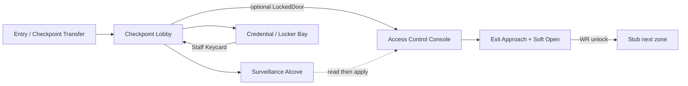

# PE-021 — Visual Design Package: Security Wing

**Status:** Previsualization complete — awaiting EP mental-play APPROVE  
**Mission:** PE-021 Security Wing (Post-Research Access)  
**Map:** `/Game/ProjectEcho/Maps/Production/LV_ARI_SecurityWing`  
**Branch:** `develop`  
**Date:** 2026-07-25  
**Design Plan:** [`PE-021-DesignPlan.md`](PE-021-DesignPlan.md)  
**Mission notes:** TBD on Implement (`PE-021-SecurityWing.md`)  
**Authority:** Gameplay Design Bible (PE-016) §5.3 Security & Access · Production Playbook §12c · Visual Design Package standard  

---

> ### Gate
>
> **STOP — waiting for EP: VDP APPROVE / RETURN TO DESIGN**  
> Ready to Implement = **NO** until EP decision = APPROVE.  
> Docs only — no Unreal maps / Blueprints / MCP asset creation in this phase.  
> MCP Auto-accept does **not** apply until `Implement Mission PE-021`.

---

## Creative layout intent (environment-designer)

Thin Creative pass from Design Plan §3 before blockout (no conflicting adjacency):

| Intent | Spec |
|--------|------|
| **Spine** | West spawn → Center Lobby hub → South Access Control → Far South/East Exit |
| **Spurs** | North Surveillance Alcove (env density); East Credential / Locker Bay (keycard) |
| **Gate story** | Prefer Lobby inner `BP_LockedDoor` after keycard → Console (one credential story); cut to console-only consume if length pressure |
| **Guidance** | Glass checkpoint + camera banks as landmarks; Soft Open exit silhouette readable from Lobby south |
| **Witness** | Exit Approach only; post-solve |
| **Lighting zones** | Indoor checkpoint-dim baseline (post-power narrative); no outdoor Directional/Sky dominance |
| **Cut order** | Surveillance Alcove → Lobby LockedDoor gate → never Signal/PA second family → never Armory |

---

## 1. Mission Overview

| Field | Content |
|-------|---------|
| **Fantasy** | After Research Wing finishes enough containment work, Soft Open loads the player into Asterion’s **Security Wing** — a checkpoint / surveillance / access-control sector left mid-lockdown. Staff fled with badges on trays and a clearance console unfinished. Recover the **Staff Keycard**, finish the **access clearance** procedure, release the Soft Open exit. Something watches past the cameras on the way out. |
| **Length** | ~15–20 minutes first play |
| **Rooms** | Entry / Checkpoint Transfer · Checkpoint Lobby · Surveillance Alcove · Credential / Locker Bay · Access Control / Console Ops · Exit Approach + Soft Open Exit |
| **Systems reused** | Interaction, Inventory (`BPC_Inventory`, `BP_KeyItemPickup`), Notes, Objectives, `BP_PuzzleBase`, `BP_LockedDoor`, Power receivers / SoftOpenExit / EmergencyLight / PA / ambient, Witness silhouette, SliceReset twin, PE-018 map recipe, Soft Open Research→Security |
| **Teaching beat** | **Security & Access** (Bible §5.3) — observe lockdown residue → recover credential → clear access console — distinct from fuse, generator fuel, coolant valves, Research Equipment |
| **Horror beat** | Quiet institutional unease → focused clearance → relief when lockout clears → **Witness on exit approach** (silhouette; colder / more institutional than Research) |
| **Cut list** | Surveillance Alcove · Lobby LockedDoor (allow console-only keycard) · Signal/PA as second family · Armory · Restricted · fuse · generator · coolant/research redo · Witness during solve · combat/chase |
| **Pillars** | Exploration · Observation · Psychological Tension · Environmental Storytelling · Meaningful Progression |

**Experience Summary:** The wing should feel like ordinary interrupted security ops waking wrong — glass, cameras, badge desks, and institutional silence under a post-power hum. Environmental storytelling carries length; one coherent credential + clearance problem; presence only after access restores. Notes are symptoms only — never walkthroughs.

**Emotional Curve:**

```text
Quiet institutional entry
    → Curiosity / unease (Lobby tape + dark monitors)
        → Focus (keycard recover → clearance console)
            → Relief (exit unlock / surveillance response)
                → Spike (Witness on exit approach)
                    → Release (Soft Open stub next zone)
```

---

## 2. Player Journey

```text
Beginning → Middle → Ending
```

### Beginning (Spawn → Explore → Observe)

Player Soft Opens from Research Wing LabExit into **Entry / Checkpoint Transfer**. Flashlight available. Partial checkpoint lighting and camera hum (post-power + post-coolant + post-containment narrative baseline) — but lockdown / clearance unfinished. Soft Open exit is locked.

- Read **Note A** (symptoms: access gated until lockdown clearance / plant feed OK — no directions).
- Hub opens into **Checkpoint Lobby**: desk, lockdown tape, visitor residue; paths to Surveillance, Credential Bay, Access Control (or LockedDoor gate).
- Tone shift: institutional-industrial (badge desks, glass, cameras) vs Research clinical glass / Coolant wetness.

### Middle (Observe → Understand → Operate)

- **Surveillance Alcove:** Dark monitors, procedure boards. **Note B** incomplete clearance IDs / console station labels (Badge Present / Zone Unlock / Exit Arm crumbs — not walkthrough). Light backtrack Surveillance → Console is intentional.
- **Credential / Locker Bay:** Abandoned badge trays, unfinished shift. **Note C**. Interact **Staff Keycard** (`BP_KeyItemPickup`).
- **Optional Lobby gate:** If kept, `BP_LockedDoor` requires Staff Keycard to reach Console (same credential story — not a second puzzle family).
- **Access Control / Console Ops:** **Note D** (do not open exit corridor under incomplete clearance). Present/consume keycard + match 2–3 console states → `MarkSolved` via thin `BP_AccessClearancePuzzle`. Incomplete → readable fail (amber / PrintString debt); exit stays locked. No timer. No randomized solution. No biometric cascade.

### Ending (World Response → Witness → Exit)

- Clearance complete → **World Response:** Soft Open exit unlock; checkpoint lights / monitors / ambient via `WorldResponseTargets` (+ optional `NotifyPuzzlePowerResponse` — **independent** of generator `HasHandledPower`).
- **Exit Approach:** Delayed Witness silhouette + cold institutional light → withdraw. Not during keycard / console.
- Interact **Soft Open Exit** → stub next zone (Signal / deeper Admin / Restricted approach — not built).
- SliceReset supports replay without UE restart (incl. keycard respawn / inventory clear as applicable).

---

## 3. Top-down Blockout

**Compass:** +Y = North, +X = East (match PE-017 / PE-018 / PE-019 / PE-020).  
**Recipe:** PE-018 production map spine retargeted to Security / Access narrative.

### Floor plan (ASCII)

```text
                              N (+Y)
                              ▲
                              │
             ┌────────────────┴────────────────┐
             │     SURVEILLANCE ALCOVE          │
             │  [dark monitors / boards]        │
             │  Note B ★                        │
             │  Landmark: camera bank wall      │
             └────────────┬─────────────────────┘
                          │ short spur
   W ◄────────────────────┼───────────────────────► E (+X)
        ┌─────────────────┴─────────────────┐
        │  ENTRY / CHECKPOINT TRANSFER      │
        │  ★ Spawn (Soft Open from Research)│
        │  Note A                           │
        │  Landmark: transfer glass /         │
        │  checkpoint frame                 │
        └─────────────────┬─────────────────┘
                          │
        ┌─────────────────┴─────────────────────────┐
        │         CHECKPOINT LOBBY (HUB)             │
        │  Desk · lockdown tape · visitor stamps     │
        │  Landmark: glass checkpoint desk           │
        │  🔐 Optional LockedDoor → Console          │
        └──────┬──────────────┬──────────────┬───────┘
               │              │              │
               │         ┌────┴────┐         │
               │         │ CREDENTIAL /      │
               │         │ LOCKER BAY        │
               │         │ Note C            │
               │         │ ◆ Staff Keycard   │
               │         │ Landmark: badge   │
               │         │ trays / lockers   │
               │         └─────────┘         │
               │                             │
        ┌──────┴─────────────────────────────┴──────┐
        │  ACCESS CONTROL / CONSOLE OPS              │
        │  Note D                                    │
        │  ◆ Console states: Badge / Zone / Exit Arm │
        │  ◈ BP_AccessClearancePuzzle                │
        │  Landmark: clearance console island        │
        └──────────────────┬─────────────────────────┘
                           │
        ┌──────────────────┴─────────────────────────┐
        │  EXIT APPROACH + SOFT OPEN EXIT             │
        │  👁 Witness (post-solve only)               │
        │  Note E (optional unease)                   │
        │  🚪 Soft Open Exit LOCKED until WR          │
        │  Landmark: powered checkpoint exit door     │
        └─────────────────────────────────────────────┘
                           │
                           ▼ S / SE
```

**Legend**

| Symbol | Meaning |
|--------|---------|
| ★ | Spawn / Soft Open arrival / primary note landmark |
| ◆ | Interactive ops (keycard pickup / console states) |
| ◈ | Puzzle actor (`MarkSolved` owner) |
| 🔐 | Optional Lobby LockedDoor (keycard gate) |
| 👁 | Witness presence (exit path; post-solve) |
| 🚪 | Objective lock / Soft Open Exit |
| Note A–E | Symptom note pickups |

### Room connections



| From | To | Notes |
|------|-----|-------|
| Entry | Checkpoint Lobby | Primary hub arrival |
| Lobby | Surveillance Alcove | North spur — env story densify; cut first if length pressure |
| Lobby | Credential / Locker Bay | East — Staff Keycard pickup |
| Lobby | Access Control | South — via optional LockedDoor or direct after keycard literacy |
| Surveillance | Console | Light backtrack OK (read → apply) |
| Access Control | Exit Approach | Locked until Access Clearance WR |
| Soft Open Exit | Stub next zone | Signal / deeper sector — not built |

### Landmark map

| Landmark | Room | Player read |
|----------|------|-------------|
| Transfer glass / Soft Open arrival | Entry | Continuity from Research LabExit |
| Glass checkpoint desk + lockdown tape | Lobby | “Evacuation mid-clearance” |
| Dark camera bank / monitors | Surveillance Alcove | Systems return; something should be watching |
| Badge trays / open lockers | Credential Bay | Credential problem readable at a glance |
| Clearance console island (3 labeled states) | Access Control | Ops problem readable; one ownership |
| Powered Soft Open Exit | Exit Approach | Goal door; locked until WR |
| Witness silhouette niche | Exit Approach | Post-solve presence only |

### Dimension intent (blockout scale)

| Room | Intent scale | Feel |
|------|--------------|------|
| Entry / Checkpoint Transfer | Narrow corridor ~8–12 m | Quiet Soft Open arrival spine |
| Checkpoint Lobby | Mid hub ~12–16 m | Desk + branching readable |
| Surveillance Alcove | Short spur ~6–8 m | Look-at monitors; densify then leave |
| Credential / Locker Bay | Mid room ~8–12 m | Trays / lockers as keycard landmark |
| Access Control / Console Ops | Focused ops volume ~10–14 m | Console island center; states readable |
| Exit Approach | Short corridor to door ~6–10 m | Compression before Witness |

---

## 4. Storyboard

Ordered scenes for mental play: **enter → notice → discover → solve → world response → Witness → exit**.

### Mission timeline

```text
0:00  Soft Open / spawn Entry (from Research LabExit)
0:01  Notice camera hum vs unfinished silence; Note A
0:03  Explore Lobby — tape, desk, locked exit silhouette
0:05  Surveillance Alcove — dark monitors; Note B procedure crumbs
0:07  Credential Bay — Note C; recover Staff Keycard
0:09  (Optional) Lobby LockedDoor with keycard → Console
0:10  Access Control — Note D; present keycard + set console states
0:15  World Response — Soft Open exit unlock + surveillance / ambient
0:16  Witness on exit approach
0:18  Soft Open Exit interact → stub next zone
```

### Scene breakdown

| # | Beat | Scene | Player does | Sees / feels | Symptoms cue |
|---|------|-------|-------------|--------------|--------------|
| 1 | **Enter** | Soft Open into Checkpoint Transfer | Arrive; flashlight | Partial checkpoint light; glass frame; institutional vs Research clinical | Note A: feed OK / access gated |
| 2 | **Notice** | Lobby desk + distant locked exit | Orient hub | Lockdown tape; visitor stamps; exit gated | Spill / mute PA tags |
| 3 | **Discover** | Surveillance Alcove | Look at dark monitors; read Note B | Blank screens; procedure boards with station labels | Clearance ID crumbs — not walkthrough |
| 4 | **Discover** | Credential / Locker Bay | Scan trays; take Staff Keycard | Abandoned badges; unfinished shift | Note C: trays abandoned |
| 5 | **Understand** | Console warning | Read Note D near console | Do-not-open-exit residue | Incomplete clearance risk |
| 6 | **Solve** | Access clearance | Present keycard + set Badge Present / Zone Unlock / Exit Arm | Amber fail if incomplete | Note B labels |
| 7 | **World Response** | Checkpoint wakes | Watch unlock | Lights / monitors / ambient / Soft Open power | World acknowledges access restore |
| 8 | **Witness** | Exit Approach | Approach exit | Delayed silhouette + cold institutional light → withdraw | Note E optional unease |
| 9 | **Exit** | Soft Open Exit | Interact door | Stub next zone (Signal deferred) | Meaningful progression |

**Horror rule:** Witness never replaces solvable clearance logic; presence only after `MarkSolved`.

---

## 5. Hero Concept Prompts

Prompts only (no generated images required for this VDP). Grounded industrial horror — institutional Asterion Security, not sci-fi chrome arcade / armory spectacle.

### Color palette

| Role | Direction |
|------|-----------|
| Base | Cool concrete grey / institutional off-white panels; darker than Research clinical |
| Accent | Muted steel-blue camera housings; amber lockdown tape / caution |
| Hazard / incomplete | Soft amber console lamps; cold cyan-white emergency accents |
| Witness | Desaturated cold blue-white; reduced fill; glass reflections |

### Material palette

Brushed steel badge desks · laminated checkpoint glass · scuffed epoxy / linoleum · yellowed plastic badge trays · rubber lanyards · CCTV camera housings · printed clearance boards · cable raceways · PA mute tags · mesh locker faces.

### Mood board (prompt sets)

**1 — Entry / Checkpoint Transfer**  
`Asterion Research Institute security checkpoint transfer corridor, soft open from clinical research wing into institutional access control, partial fluorescent hum, scuffed epoxy floor, laminated glass checkpoint frame, abandoned clipboard on rail, cold concrete, psychological survival horror atmosphere, grounded industrial, no sci-fi chrome, UE5 cinematic still, desaturated`

**2 — Checkpoint Lobby (hero)**  
`Security checkpoint lobby with glass badge desk, lockdown tape across visitor lane, overturned chair, visitor pass stamps, dark camera in corner, institutional-industrial Asterion Security, quiet unfinished clearance, environmental storytelling, horror unease without gore, dim indoor lighting`

**3 — Surveillance Alcove**  
`Surveillance alcove Asterion Security, bank of blank CRT monitors, incomplete clearance procedure boards with station labels, abandoned stool, mute PA tags, systems return feel, grounded facility realism, psychological horror mood`

**4 — Credential / Locker Bay**  
`Staff locker bay security wing, abandoned badge trays mid-shift, open mesh lockers, lanyards left behind, Staff Keycard readable as gameplay landmark, institutional clutter not arcade UI, Asterion Research Institute, dim checkpoint lighting`

**5 — Access Control / Console Ops (puzzle landmark)**  
`Access clearance console island, three labeled states Badge Present Zone Unlock Exit Arm, amber incomplete lamps, keycard reader slot, industrial security equipment not sci-fi biometric cascade, Asterion Security Wing, readable gameplay landmark, dim institutional lighting`

**6 — Exit Approach + Witness**  
`Security wing exit approach after access restores, powered checkpoint door silhouette, delayed distant humanoid silhouette in cold blue-white light beyond camera bank then withdraw, colder more institutional than research lab, psychological presence horror, no chase, Asterion Security Wing`

**7 — Atmosphere pass**  
`Asterion Security Wing waking wrong, plant and labs restored but checkpoint lockdown unfinished, cameras should be watching, isolated scientific grounded tone, environmental storytelling denser than mechanics`

---

## 6. Lighting Concepts

```text
Before Power → After Power → Puzzle Solved → Witness
```

**Narrative baseline:** Security Wing is **post-power + post-coolant + post-containment**. “Before Power” here means **player arrival / incomplete clearance** (checkpoint-dim, not blackout Annex). Indoor only — no outdoor Directional/Sky dominance (PE-017A lesson).

### Lighting sequence

| Phase | Mood | Guidance | Hierarchy |
|-------|------|----------|-----------|
| **1. Arrival / incomplete clearance** (“Before”) | Checkpoint-dim; partial fluorescents; warm-cool mix; unfinished pockets of shadow under glass | Soft pool along Entry → Lobby spine; Surveillance darker (blank monitors) | Entry readable; Soft Open Exit darker / locked read |
| **2. Post-plant feed baseline** (“After Power” narrative) | Camera / PA hum lighting partially alive; desk lamps catch badge trays once player explores East | Keycard bay and console bezels catch eye after Note B | Do not flood Console — keep observe-first |
| **3. Puzzle Solved / World Response** | Surveillance monitors / checkpoint lights respond; amber → clearer whites on console; Soft Open Exit receives power light | Exit path becomes the brightest readable goal | Relief without arcade neon / armory spectacle |
| **4. Witness** | Fill drops on exit approach; cold blue-white accent on silhouette niche (glass reflection OK); then withdraw to prior WR state | Attention pulled to presence then released to door | Never blackout the solvable path |

### Visual hierarchy (mental play)

1. Lobby desk / lockdown tape (story first)  
2. Surveillance boards + Credential trays (observe → credential)  
3. Console state labels (ops)  
4. Soft Open Exit (goal after WR)  
5. Witness (momentary override on exit approach only)

### Mood board notes

- Research = clinical glass / instruments. Security = institutional glass / cameras / badge desks.  
- Incomplete console: amber. Solved: cooler white / surveillance response.  
- Witness: colder and more institutional than Research’s presence beat.

---

## 7. Asset Placement

### Placement guide

| Layer | What | Where | Readability |
|-------|------|-------|-------------|
| **Interactive** | Note A–E pickups | Entry, Surveillance, Credential, Console, Exit | Eye-level; not buried in clutter |
| **Interactive** | Staff Keycard (`BP_KeyItemPickup`) | Credential / Locker Bay trays | Clear tray landmark; line-of-sight from bay entry |
| **Interactive** | Optional Lobby `BP_LockedDoor` | Lobby south toward Console | One credential story; readable gate |
| **Interactive** | Console state interacts + `BP_AccessClearancePuzzle` | Access Control island | Labels Badge / Zone / Exit Arm; one ops ownership |
| **Interactive** | Soft Open Exit (`BP_SoftOpenExit` / PoweredDoor pattern) | Exit Approach | Silhouette readable as door goal |
| **Interactive** | SliceResetButton | Dev-accessible; not story clutter | Replay support |
| **Static** | Checkpoint glass / desk / camera banks / locker shells | Lobby + Surveillance + Credential | Landmark scale; function readable |
| **Static** | Soft Open arrival framing | Entry | Continuity from Research LabExit language |
| **Decoration** | Lockdown tape, visitor stamps, overturned chair, lanyards, PA mute tags, cable raceways | All rooms light density | Support tone; do not obscure keycard / console |
| **Storytelling** | Blank monitors, incomplete clearance logs, badge trays, visitor residue | Lobby + Surveillance + Credential + Console | Story readable before notes |
| **Horror** | `BP_WitnessSilhouetteHint` | Exit Approach only | Invisible until post-solve WR |

### Decoration plan

- Prefer **env density over prop count**: fewer hero props, clearer silhouettes.  
- Cut Surveillance Alcove first under length pressure (move Note B crumbs to Lobby boards).  
- Modular security geo / real audio still debt — blockout + light dressing acceptable; tag PrintString audio as `[PE021]` debt in mission notes.

### Gameplay readability review

| Check | Intent |
|-------|--------|
| Can EP find the Staff Keycard without a map? | Yes — Credential Bay tray landmark |
| Can EP confuse Research stations with Security console? | Institutional context + Badge/Zone/Exit Arm labels + Note B |
| Does Lobby LockedDoor feel like a second puzzle? | Same keycard story; cut if it reads as two problems |
| Does clutter hide Note B? | Boards are landmark; note near camera bank |
| Is Witness visible during solve? | **No** — exit path post-solve only |
| Is Soft Open Exit the clear post-WR goal? | Lighting + door silhouette hierarchy |

---

## 8. Gameplay Rhythm

```text
Explore → Observe → Understand → Operate → World Response → Witness → Exit
```

| Stage | Security Wing beat | Bible alignment |
|-------|--------------------|-----------------|
| **Explore** | Entry → Lobby hub → Surveillance / Credential / Console | Facility realism; 5–6 rooms |
| **Observe** | Tape, dark monitors, trays, Notes A–D (symptoms) | Env storytelling FIRST |
| **Understand** | Note B labels map to console states; keycard = credential | Observation over guessing |
| **Operate** | Recover keycard → clearance states → `MarkSolved` | Security & Access §5.3 |
| **World Response** | Soft Open exit + lights / monitors / ambient | World acknowledges access restore |
| **Witness** | Exit-approach silhouette | Survive; pressures attention |
| **Exit** | Soft Open stub next zone | Meaningful progression |

**Anti-patterns avoided:** Signal/PA second family · fuse fork · generator fuel · coolant/research redo · Armory · Restricted truth dump · biometric cascade · chase / combat · Witness during clearance · walkthrough notes · inventory redesign.

---

## Clearance solve card (mental play)

| Element | Start | Target / action |
|---------|-------|-----------------|
| Staff Keycard | In Credential Bay trays | Recover via `BP_KeyItemPickup` |
| Optional Lobby LockedDoor | Locked | Unlock with Staff Keycard (same story) |
| Console — Badge Present | Incomplete / Off | Present / set Present |
| Console — Zone Unlock | Locked | Unlock |
| Console — Exit Arm | Disarmed | Arm |

Clue source: Note B clearance procedure crumbs (station labels). Incomplete → exit locked. Prefer 2–3 states max; readable amber fail.

---

## Soft Open / campaign continuity

| Link | Spec |
|------|------|
| Research Wing → Security Wing | Research LabExit Soft Open → `LV_ARI_SecurityWing` (wire on Implement) |
| Security Entry | Spawn Entry / Checkpoint Transfer; objective BeginPlay via Reset actor |
| Security Soft Open Exit | Stub next zone (Signal / deeper sector — not built) |

---

## Executive Producer evaluation checklist

EP answers **Yes / No** to each:

| # | Question | EP |
|---|----------|-----|
| 1 | Can I understand the mission? | |
| 2 | Can I mentally walk through the level? | |
| 3 | Can I understand every objective? | |
| 4 | Can I understand every puzzle? | |
| 5 | Can I understand the pacing? | |
| 6 | Can I imagine the horror? | |
| 7 | Can I identify confusing areas? | |
| 8 | Would I enjoy playing this? | |

**Any No → RETURN TO DESIGN / Previs.** Do not set Ready to Implement.

---

## Visual Design Package — EP Gate

| Field | Value |
|-------|--------|
| VDP complete | **YES** |
| Mentally playable | *(EP)* |
| EP decision | APPROVE / RETURN TO DESIGN |
| Ready to Implement | **NO** — YES only if APPROVE |
| Notes | |

---

## Document Control

| | |
|--|--|
| Created | 2026-07-25 |
| Mission | PE-021 Visual Design Package |
| Skills applied | environment-designer (thin layout intent) · experience-designer · blockout-visualizer · storyboard-designer · concept-artist · lighting-visualizer · asset-placement-designer |
| Related | `PE-021-DesignPlan.md`, `PE-020-VisualDesignPackage.md`, `GameplayDesignBible.md`, `FacilityBible.md`, `VisualDesignPackage.md`, `ProductionPlaybook.md` |
| Unreal changes | **None** (docs-only) |
